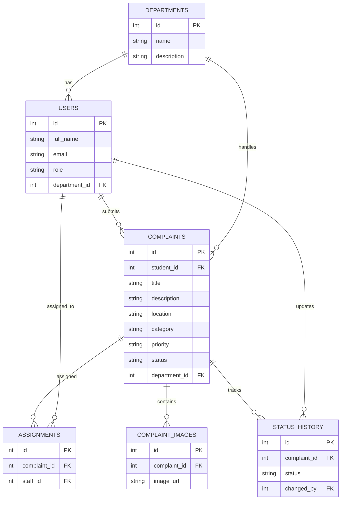

# FixAI ER Diagram

```mermaid
erDiagram

DEPARTMENTS ||--o{ USERS : has
DEPARTMENTS ||--o{ COMPLAINTS : handles

USERS ||--o{ COMPLAINTS : submits
USERS ||--o{ ASSIGNMENTS : assigned_to
USERS ||--o{ STATUS_HISTORY : updates

COMPLAINTS ||--o{ COMPLAINT_IMAGES : contains
COMPLAINTS ||--o{ ASSIGNMENTS : assigned
COMPLAINTS ||--o{ STATUS_HISTORY : tracks

DEPARTMENTS {
    int id PK
    string name
    string description
}

USERS {
    int id PK
    string full_name
    string email
    string role
    int department_id FK
}

COMPLAINTS {
    int id PK
    int student_id FK
    string title
    string description
    string location
    string category
    string priority
    string status
    int department_id FK
}

COMPLAINT_IMAGES {
    int id PK
    int complaint_id FK
    string image_url
}

ASSIGNMENTS {
    int id PK
    int complaint_id FK
    int staff_id FK
}

STATUS_HISTORY {
    int id PK
    int complaint_id FK
    string status
    int changed_by FK
}
```